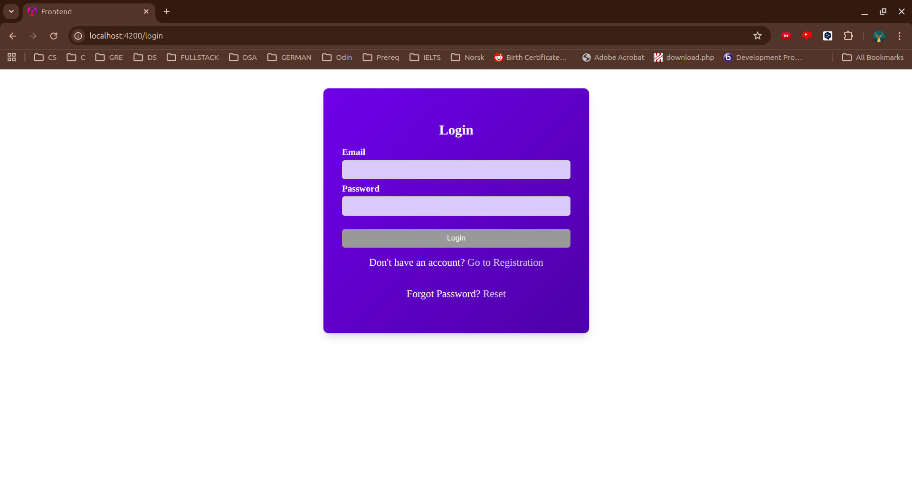
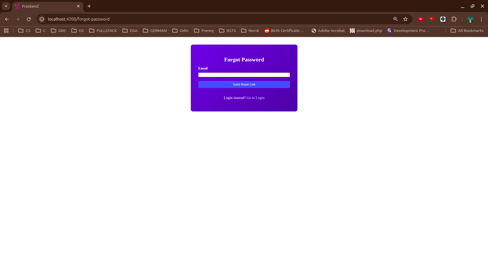
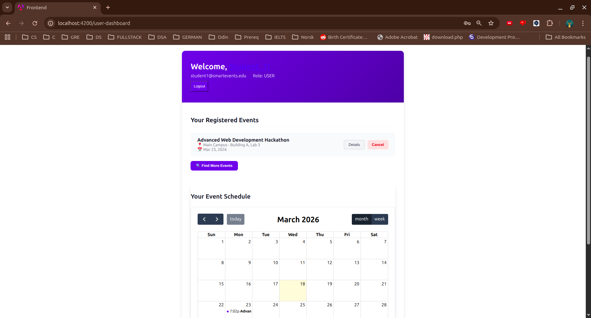
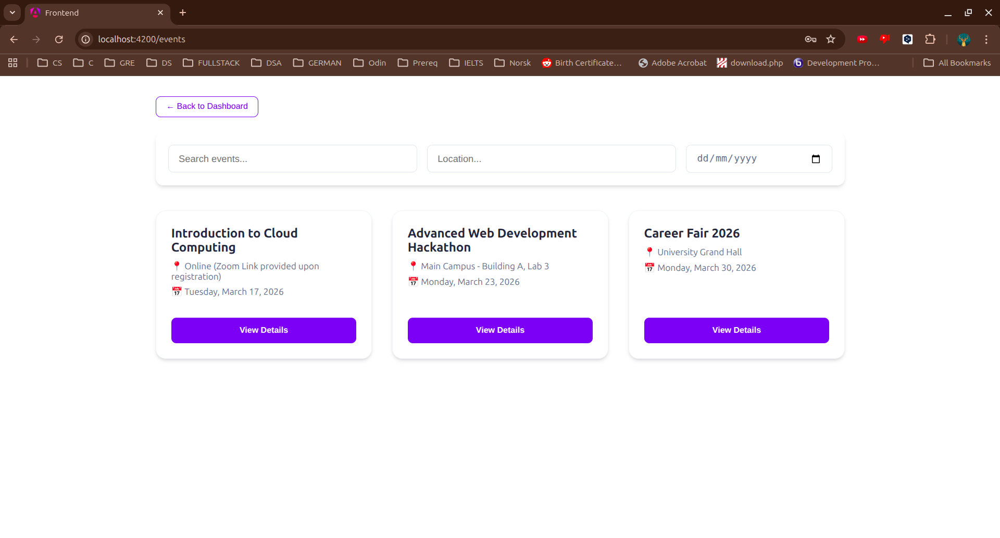
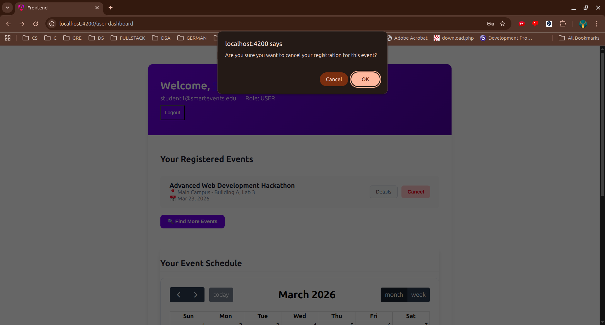
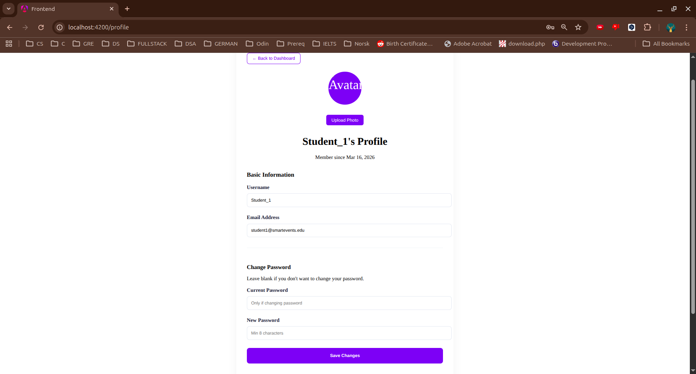
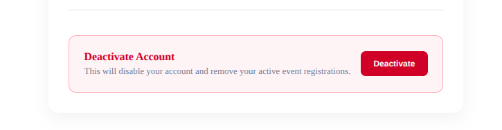
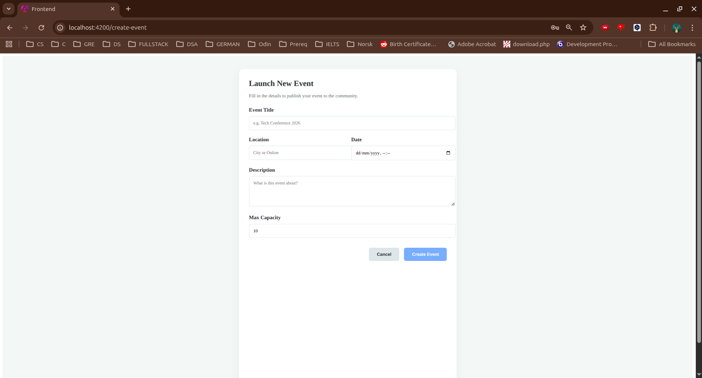
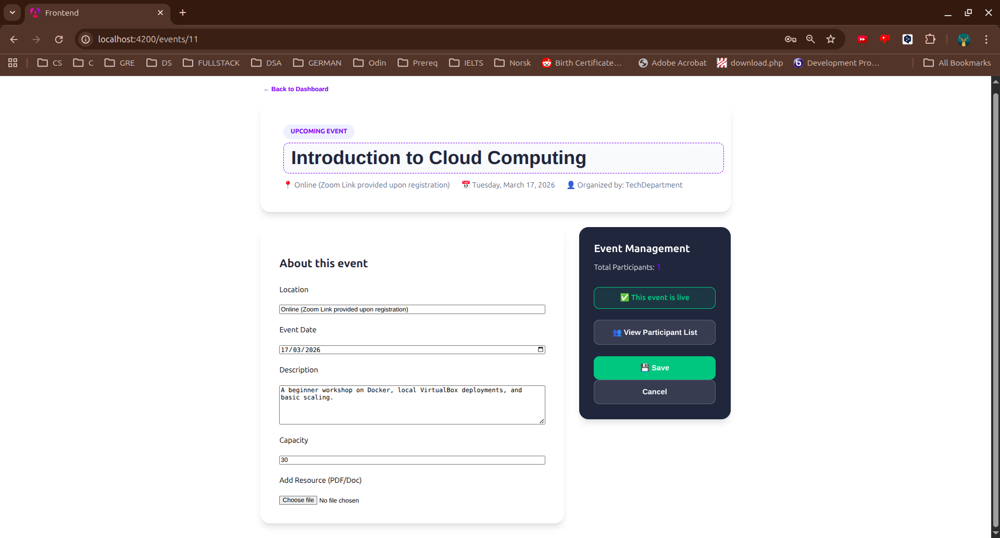

# User Guide: Smart Event Management System

Welcome to the Smart Event Management System. This guide provides step-by-step instructions on how to navigate and use the platform effectively.

---

## Table of Contents
1. [Getting Started](#getting-started)
2. [User Dashboard](#user-dashboard)
3. [Browsing & Registering for Events](#browsing--registering-for-events)
4. [Event Cancellation](#event-cancellation)
5. [Profile Management](#profile-management)
6. [Account Deletion](#account-deletion)
7. [Organizer Features](#organizer-features)
8. [Administrator Features](#administrator-features)
9. [Troubleshooting](#troubleshooting)

---

## Getting Started

To access the system, you must have an active account.

### Registration & Login
1. Navigate to the Landing Page.
2. Click on **Sign Up** if you are a new user, or **Login** if you already have an account.
3. Enter your credentials (Email and Password).
4. Click the **Submit** button.

*Figure 1: The Login Interface*

### Password Recovery (Forgot Password)
If you have forgotten your password, you can reset it using your registered email address.

1. On the Login page, click the **Forgot Password?** link.
2. Enter your registered email address and click **Send Reset Link**.
3. Check your email inbox for a password reset message.
4. Click the link in the email to be redirected to the **Reset Password** page.
5. Enter your new password, confirm it, and click **Update Password**.

*Figure 2: The Password Recovery request form*

## User Dashboard

After logging in, you will land on your User Dashboard. This is your personalized home screen.

* Upcoming Events: A list of events you are currently registered for.
* Quick Stats: Overview of your event activity.
* Notifications: Alerts about time changes or updates from organizers.

*Figure 3: Overview of the User Dashboard and Statistics*

---

## Browsing & Registering for Events

1. Click **Browse Events** in the top navigation bar.
2. Use the **Search Filters** to find specific events by Title, Location, or Date.
3. Click on an Event Card to see full details.
4. Click **Register Now** to sign up for the event.

*Figure 4: Using filters to find and join events*

---

## Event Cancellation

If you can no longer attend an event, you should cancel your registration to free up space for others.

1. Go to your User Dashboard.
2. Find the event under the "Upcoming Events" section.
3. Click the **Cancel Registration** button.
4. Confirm the cancellation in the pop-up window.

*Figure 5: The cancellation confirmation workflow*

---

## Profile Management

You can update your personal information and adjust your avatar to keep your account current.

1. Click on your Name or Profile Image in the top navigation bar.
2. Select **Profile Settings**.
3. To update your avatar, click on the profile image to upload a new one, or select the option to delete your current avatar.
4. You can also update your Display Name, Contact Email, and Bio.
5. Click **Save Changes** to apply the updates.

*Figure 6: Updating personal account details*

---

## Account Deletion

If you wish to stop using the service and remove your data, you can delete your account.

1. Navigate to Profile Settings.
2. Scroll to the bottom of the page to the **Danger Zone**.
3. Click **Delete Account**.
4. You will be asked to enter your password to confirm that you want to permanently remove your account and all associated data.

*Figure 7: Locating the account deletion option in the Danger Zone*

> **Warning:** This action is permanent and cannot be undone.

---

## Organizer Features

Users with the **ORG** role have access to management tools to host their own events.

### Creating and Publishing
1. Go to the Organizer Dashboard.
2. Click **Create Event** and fill in the event details.
3. You can also upload event images or supplementary files.
4. Click **Publish** to make the event visible to the public.

*Figure 8: The event creation form*

### Editing or Canceling an Event
If details change after an event is created, organizers can update them:
1. From the Organizer Dashboard, click the **Edit icon** next to the specific event.
2. Modify the title, date, location, or description as needed.
3. Click **Update Event** to save the changes. Registered participants will be notified of the update.
4. If an event must be canceled entirely, select the **Cancel Event** option. All registered attendees will be notified.

*Figure 9: Modifying an existing event's details*

### Generating Reports
Organizers can view lists of participants and generate detailed event turnout reports.
1. Select the event you wish to monitor.
2. Click on **Generate Report** to receive real-time updates and download comprehensive analytic data on user registrations.

---

## Administrator Features

Users with the **ADMIN** role have overarching access to maintain the platform's integrity.

### Dashboard & Statistics
The Admin Dashboard provides high-level aggregate data representing active events, total user count, and platform-wide engagement.

### User Management
- View a comprehensive directory of all registered users.
- Use the management controls to update user roles (e.g., granting someone the ORG role).
- **Deactivate/Reactivate:** Admins can soft-delete (deactivate) or reactivate user accounts who violate platform policies.

### Global Event Moderation
- Admins can manage the full list of events (including unpublished or canceled events).
- Inappropriate events can be manually suspended or canceled by administrators.

### System Logs
Access the **System Logs** view to retrieve paginated comprehensive audit logs categorized by `INFO`, `WARN`, and `ERROR` tags to track significant platform actions securely.

---

## Troubleshooting

| Issue | Potential Solution |
| :--- | :--- |
| Login Failed | Check your credentials or use the "Forgot Password" link. |
| Event Not Found | Broaden your search filters or check the "All Events" tab. |
| Cannot Delete Account | Ensure you have no active organized events that are currently live. |
| Edit Not Saving | Ensure all required fields are filled out correctly before clicking Update. |
